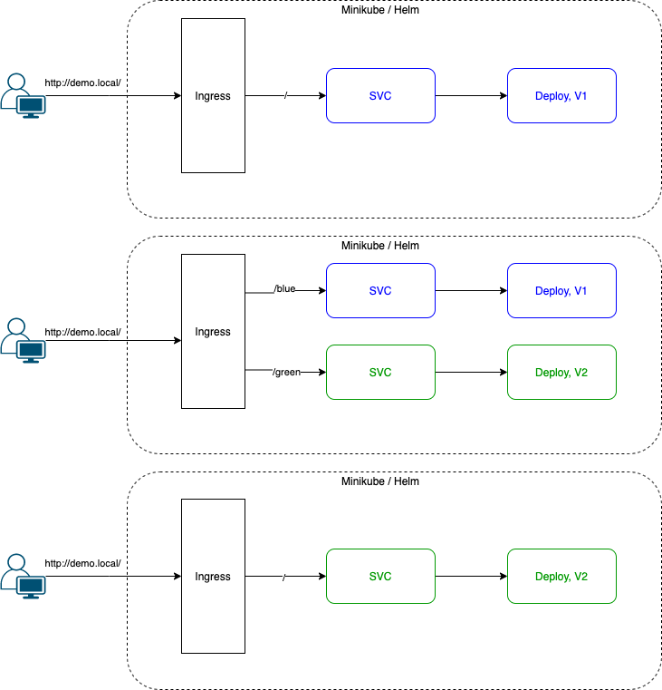

```
 ____  _                 __   ____
| __ )| |_   _  ___     / /  / ___|_ __ ___  ___ _ __
|  _ \| | | | |/ _ \   / /  | |  _| '__/ _ \/ _ \ '_ \
| |_) | | |_| |  __/  / /   | |_| | | |  __/  __/ | | |
|____/|_|\__,_|\___| /_/     \____|_|  \___|\___|_| |_|

 ____             _                        _ _   _
|  _ \  ___ _ __ | | ___  _   _  __      _(_) |_| |__
| | | |/ _ \ '_ \| |/ _ \| | | | \ \ /\ / / | __| '_ \
| |_| |  __/ |_) | | (_) | |_| |  \ V  V /| | |_| | | |
|____/ \___| .__/|_|\___/ \__, |   \_/\_/ |_|\__|_| |_|
           |_|            |___/
 _   _      _
| | | | ___| |_ __ ___
| |_| |/ _ \ | '_ ` _ \
|  _  |  __/ | | | | | |
|_| |_|\___|_|_| |_| |_|
```
# Workflow


# Prepare minikube
```bash
$ minikube start --driver=hyperkit --kubernetes-version=latest --cpus 4 --memory 8192
```
# Setup demo.local hostname in localhost
```
# DEMO_IP=`minikube ip`
# sudo echo "$DEMO_IP demo.local" >> /etc/hosts
```
# Modify the ingress.hosts.paths to enable Blue and Green
* it can be **[blue]**, **[bule,green]** or **[green]**

# Install with helm and verify the change
```
# helm install [RELEASE NAME] .
# helm test [RELEASE NAME] .
```
# Demo
[Record](https://asciinema.org/a/TEzBH5RWsuSWHJ84e1QXZV7iN)